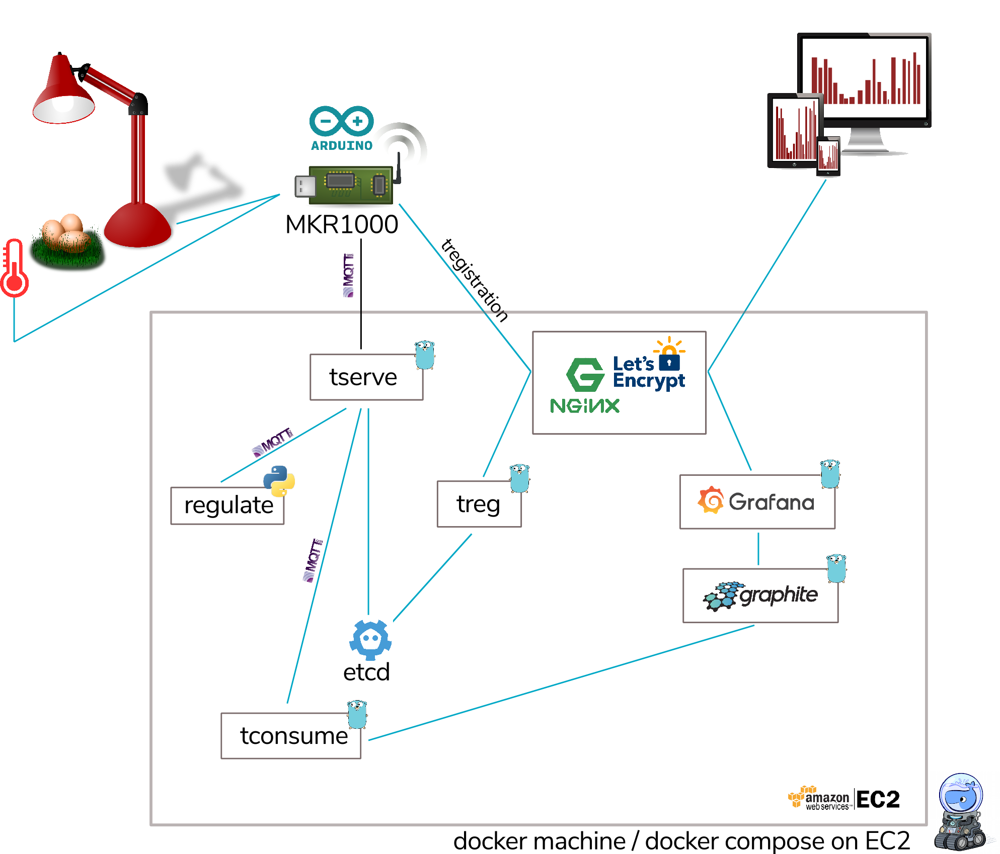
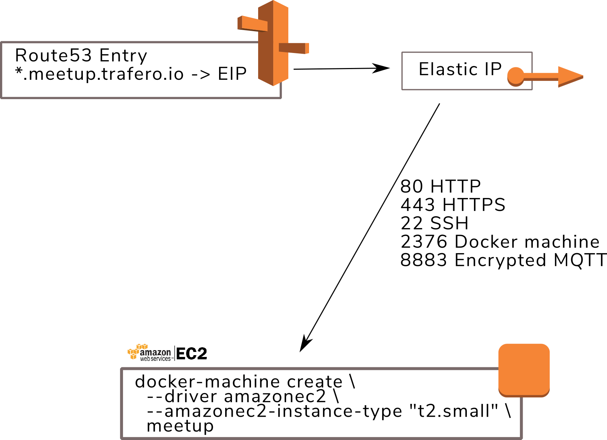
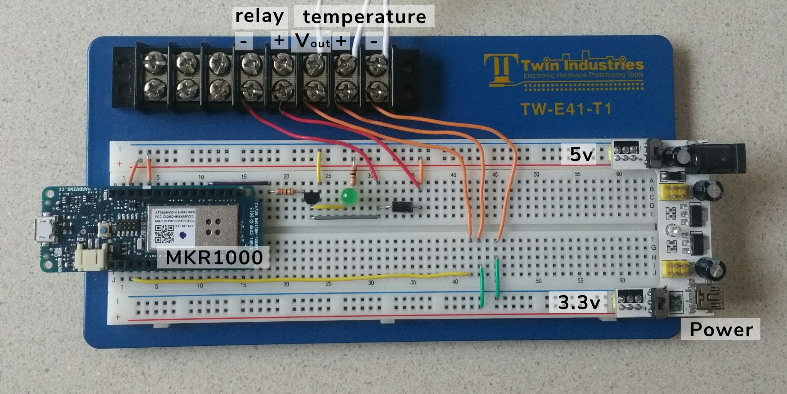

This is the code for a meetup talk I gave where I demonstrated using an Arduino, a temperature sensor, and a relay (attached to a desk lamp as a heater), to control temperature.  The temperature is also stored in a graphite database and graphed with grafana.

You may well be wondering why there's a picture of some eggs in the architecture diagram. For the demo, I demonstrated how this could be used to accurately control temperature for incubating condor eggs (inspiration from [Pied Piper's](http://www.piedpiper.com/) first successful web streaming).

## Files

* docker-compose.yml - [docker compose file](https://docs.docker.com/compose/) for bringing up the stack
* .env - Environment variables for docker compose
* regulate - Directory for "regulate" container which runs python code to monitor the temperature and send control requests to turn the lamp on and off
* sketch/controller/controller.ino - Arduino code

## Software Stack

The complete solution looks like the diagram below. Everything in the grey box is describe in the docker-compose file.

To replicate this setup you'll need somewhere to build the software stack. I used [docker machine](https://docs.docker.com/machine/) on AWS.  It will need two domain names; one for [tserve](https://github.com/trafero/tstack/blob/master/docs/tserve.md) as well as [treg](https://github.com/trafero/tstack/blob/master/docs/treg.md), and one for [Grafana](https://grafana.com/).

The following ports will need to be open (for TCP):

* 80 - HTTP traffic (for redirects to HTTPS)
* 443 - HTTPS traffic (for grafana and treg)
* 2376 - Docker machine
* 8883 - Encrypted MQTT for tserve

Before running the docker compose file, change any variable in .env that starts with "TODO"

You may also want to change the temperature ranges in regulate/regulate.py. This is the code which sends control messages to tell the arduino to turn off or turn on the lamp.

### Grafana

The Grafana web interface should be accessed from the domain name you configured in the .env file. Before you can use it you'll need to [set the graphite instance up as a data source](http://docs.grafana.org/features/datasources/graphite/). The URL for graphite will be _http://graphite:8000_. Leave the proxy option checked so that grafana connects to graphite through the internal docker network.

There's a handy [getting started](http://docs.grafana.org/guides/getting_started/) guide for Grafana which explains how to create graphs, but before you do this, you'll need to set up the hardware so it has some temperature readings to plot.

## Hardware

To make this work I used:

* Arduino MKR1000
* SSR-40 solid state relay
* TMP36 temperature sensor
* 2 x 1K Ω resistors
* LED
* NTE85 NPN transistor
* NTE156 diode (for surge protection)

Before uploading the arduino code (using the [arduino IDE](https://www.arduino.cc/en/Main/Software)), you'll want to change the variables at the top which start with "TODO".

The Arduino code uses the WiFI101 library and the MQTT library by Joel Gaehiler.  Both of these are available in the arduino IDE's library manager. You'll also need to [upload your TLS certificates](https://www.arduino.cc/en/Tutorial/FirmwareUpdater) to your device, otherwise your device will silently fail to connect to the MQTT broker. These certificates are created by [Let's Encrypt](https://letsencrypt.org/) when you start up your software stack for the first time.

--------------------------

If you have any problems, please feel free to [create an issue](https://github.com/douglas-gibbons/regulate/issues).  Please do [let me know](https://trafero.io/contact.html) if you found any of this useful!
